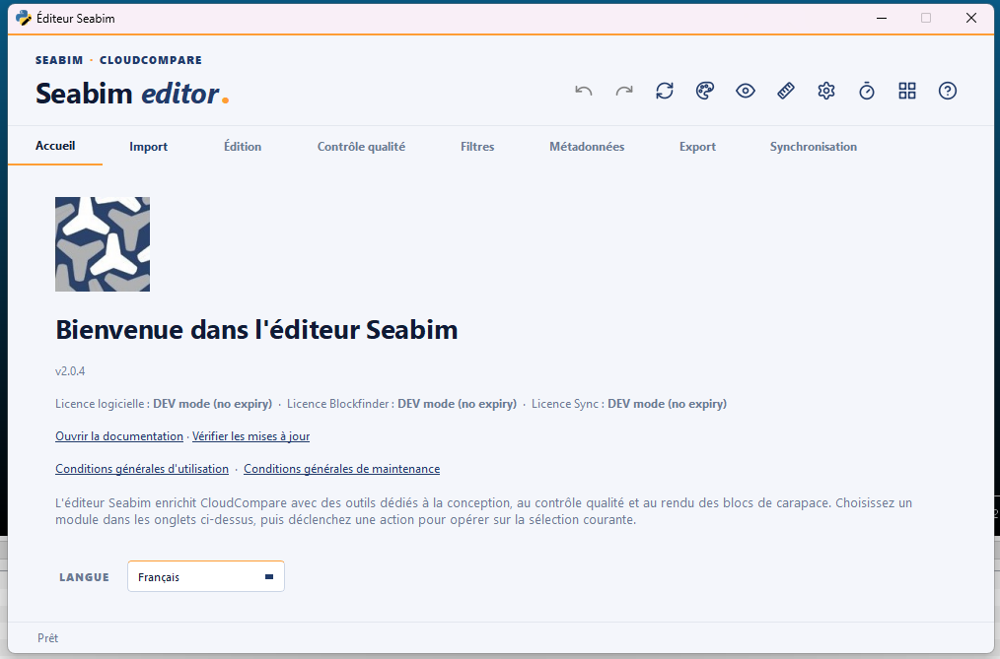
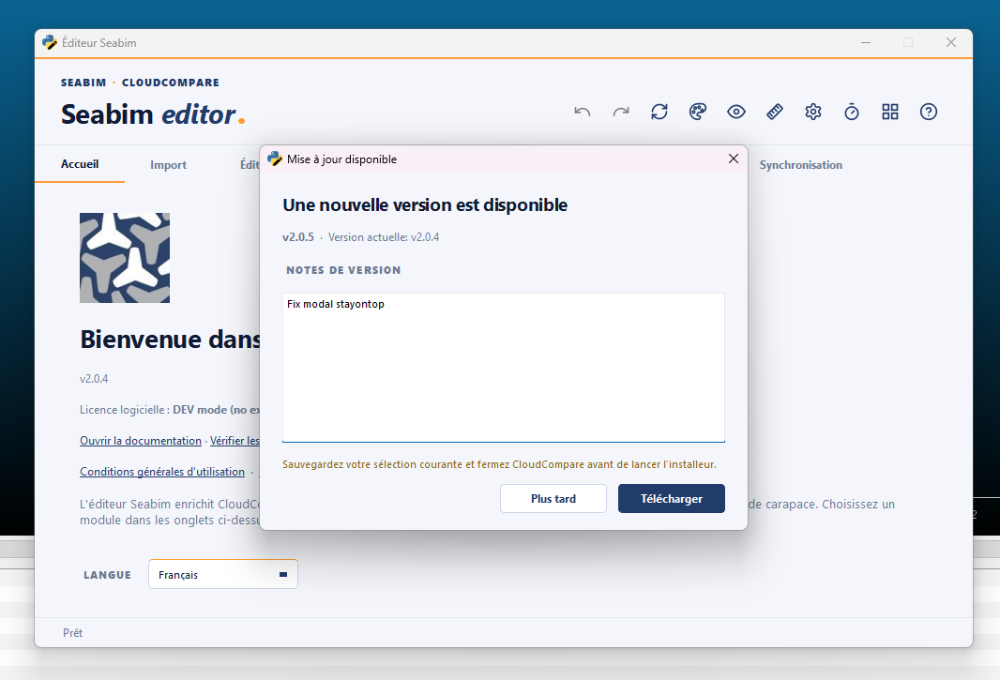

# Page d'accueil

L'onglet **`Accueil`** est le premier onglet du launcher SEABIM Editor. Il ne
contient pas d'action sur la structure : c'est la page d'**état** du plugin
(version, licence, options actives) et le point d'accès à la **documentation**,
aux **mises à jour** et aux **documents légaux**.

## Informations affichées

- **Version** du plugin installé (`vX.Y.Z`).
- **État de la licence** : la fenêtre de validité de la licence logicielle, et
  — si elles sont incluses — les licences **Blockfinder** et **Sync**. Si la
  licence est invalide, la mention **`Non activée`** s'affiche en rouge et les
  onglets modules restent grisés (cf. [Activation de la
  licence](activation-licence.md)).
- **Badges optionnels** :
    - **Version LAB activée** — les volumes de blocs sont exprimés en cm³ et
      les échelles sont expérimentales.
    - **Unités impériales (pieds)** — l'unité de longueur de travail est le
      pied (cf. [`Basculer mètres / pieds`](../modules/header.md#switch-units)).

## Liens

- **Ouvrir la documentation** — ouvre ce site dans le navigateur, dans la
  langue courante.
- **Vérifier les mises à jour** — voir [ci-dessous](#updates).
- **Conditions d'utilisation** / **Conditions de maintenance** — ouvrent les
  documents légaux (CGU / CGM) dans une fenêtre dédiée.
- **Langue** — sélecteur Français / English / العربية ; le launcher est
  retraduit immédiatement.

## Mises à jour { #updates }

Le bouton **`Vérifier les mises à jour`** interroge le serveur de mises à jour
SEABIM. Une **licence valide est requise** : sans elle, un avertissement
s'affiche et aucun appel réseau n'est fait.

!!! info "Vérification automatique au démarrage"
    Le plugin vérifie aussi la disponibilité d'une mise à jour **au lancement**.
    Si une version plus récente existe, la fenêtre ci-dessous s'ouvre
    automatiquement. Choisir « Plus tard » ne la réaffiche plus pour la session
    en cours.

Résultats possibles de la vérification :

- **Aucune mise à jour** / **vous utilisez la dernière version** — message
  d'information, rien à faire.
- **Erreur réseau / serveur / authentification** — un message explique la cause
  (connexion, serveur indisponible, installation refusée…) ; recommencer plus
  tard ou contacter le support selon le cas.
- **Mise à jour disponible** — la fenêtre **`Mise à jour disponible`** s'ouvre.

### Procédure de mise à jour

Quand une nouvelle version est disponible :

1. La fenêtre affiche le **numéro de la nouvelle version**, la version courante
   et les **notes de version**.
2. **Enregistrez votre travail** (un [`Sauvegarder un
   JSON`](../modules/output.md#save-json)) et préparez-vous à **fermer
   CloudCompare** — l'installeur ne peut pas s'exécuter pendant que le plugin
   tourne.
3. Cliquez sur **`Télécharger`** (ou **`Plus tard`** pour reporter).
4. Choisissez l'**emplacement** où enregistrer l'installeur `.exe`. Le
   téléchargement démarre avec une barre de progression.
5. Une fois le `.exe` téléchargé, **fermez CloudCompare**, puis **exécutez
   l'installeur** pour appliquer la mise à jour (voir
   [Installation](installation.md)).

!!! note "Téléchargement authentifié"
    Le téléchargement de l'installeur passe par le plugin (il joint la clé
    `X-API-KEY` de votre poste). Il n'est donc pas possible de le récupérer
    directement depuis un navigateur.
