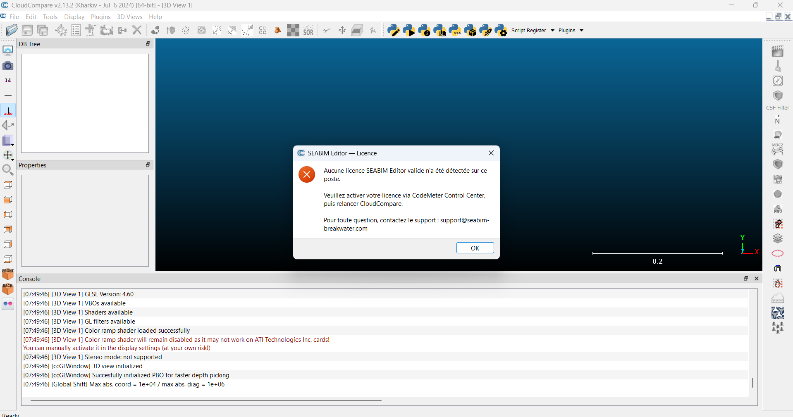
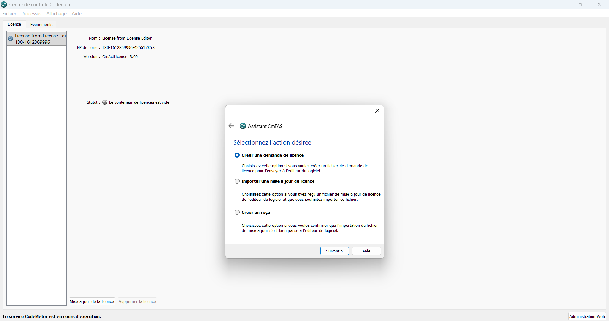
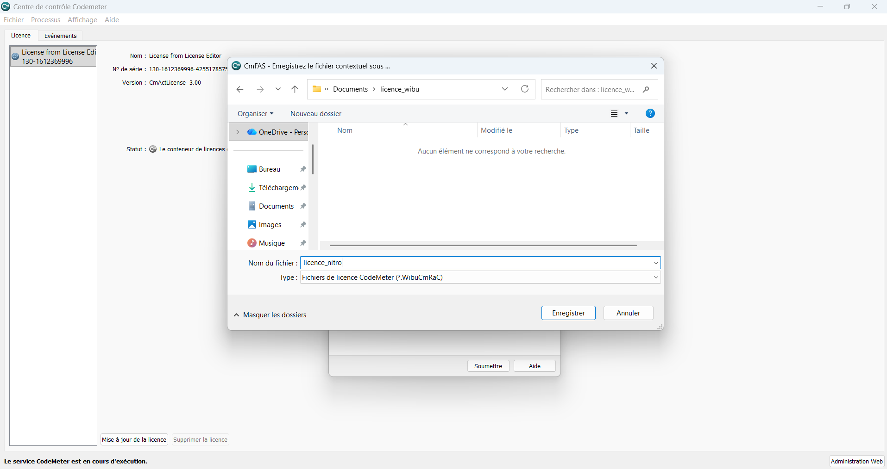
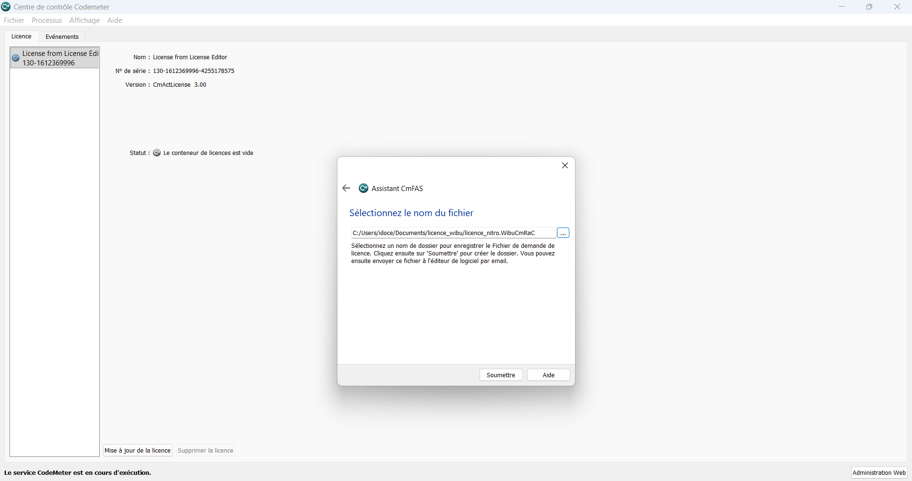
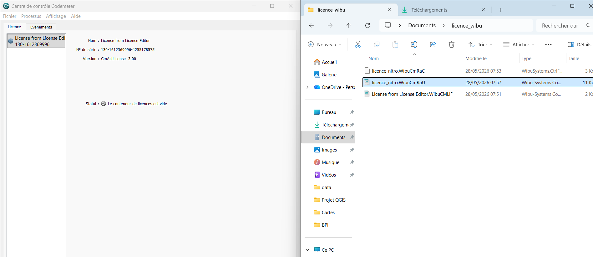
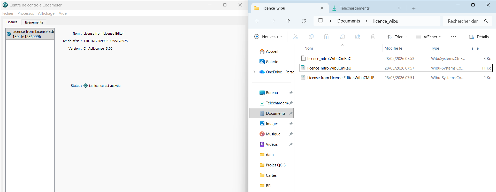
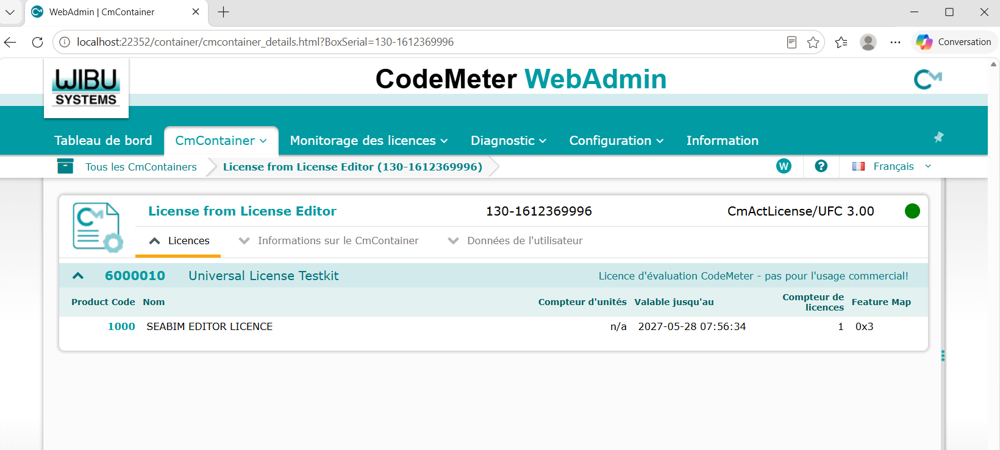

# License activation

This page describes the procedure for activating a SEABIM Editor license
using **CodeMeter Runtime** from WIBU-SYSTEMS. It is performed **only
once per workstation**, after [installing the plugin](installation.md) and
before being able to create a [first project](premier-projet.md).

## Prerequisites

- [SEABIM Editor installed](installation.md) and working in CloudCompare.
- CodeMeter Runtime installed on the workstation (see the Prerequisites
  table on the [Installation](installation.md#prerequis) page).
- An initial **`.lif`** license file provided by the SEABIM team.

## 1. Check the absence of any active license

Once SEABIM Editor is correctly installed, a dedicated icon appears in
the right sidebar of CloudCompare. As long as no license has been
activated in CodeMeter Runtime, clicking that icon displays the
no-license message:

## 2. Import the `.lif` file

1. Save the received `.lif` file in a folder of your choice.
2. Open **CodeMeter Control Center**.
3. Drag and drop the `.lif` file into the application window.

The license then appears in the list: a **CmContainer** has just been
created on your workstation.

## 3. Request the license activation

The next step is to generate a **license request** (`.RaC` file) that the
SEABIM team will use to issue your final license.

1. In CodeMeter Control Center, click **"License update"** at the bottom
   right.
2. Follow the wizard screens:

3. Send the resulting **`.RaC`** file to the SEABIM team.

In return, you will receive a **`.RaU`** file to import in CodeMeter
Control Center following the same procedure (drag-and-drop or via the
update wizard).

## 4. Check the license in CodeMeter WebAdmin

You can check at any time the detailed information of your license from
**CodeMeter WebAdmin**:

## 5. Confirm activation in CloudCompare

To finalize, open CloudCompare and click the **SEABIM** icon in the
sidebar. A summary window opens with the license information:
activation is successful.

At that point you can move on to creating your [first
project](premier-projet.md).

!!! tip "In case of trouble"
    Keep the `.lif`, `.RaC` and `.RaU` files safe, and contact the SEABIM
    support attaching a screenshot of the error message shown by
    CodeMeter Control Center or by the SEABIM Editor launcher.
