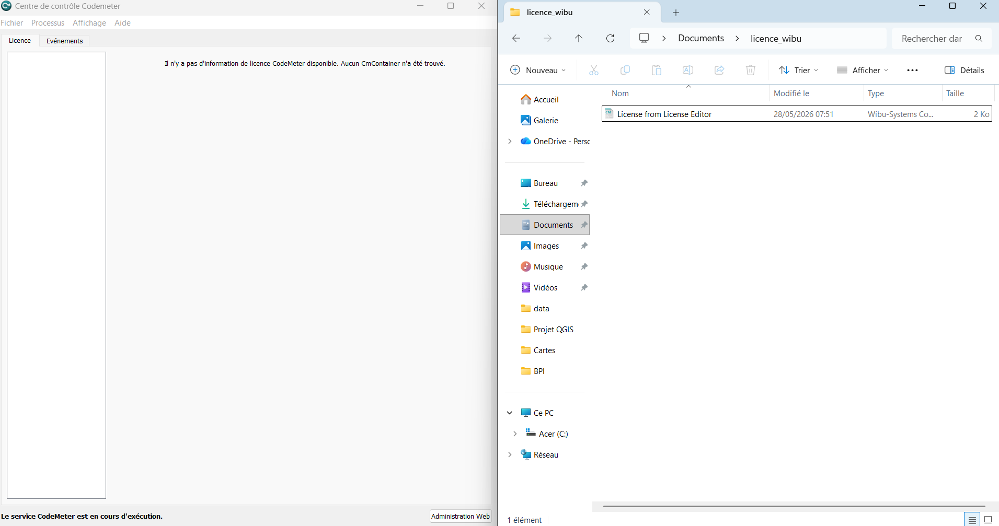
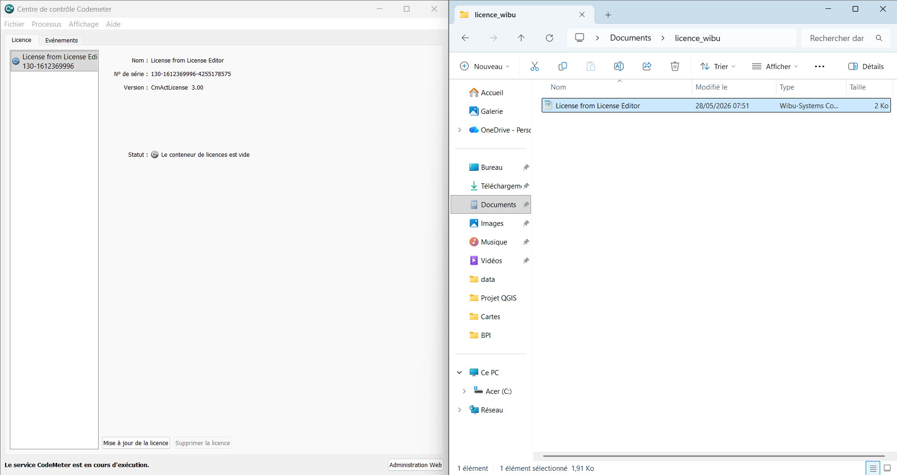
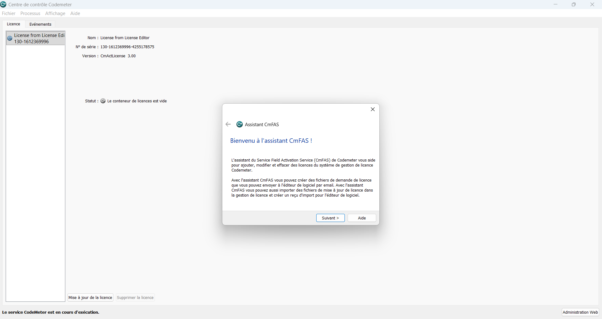
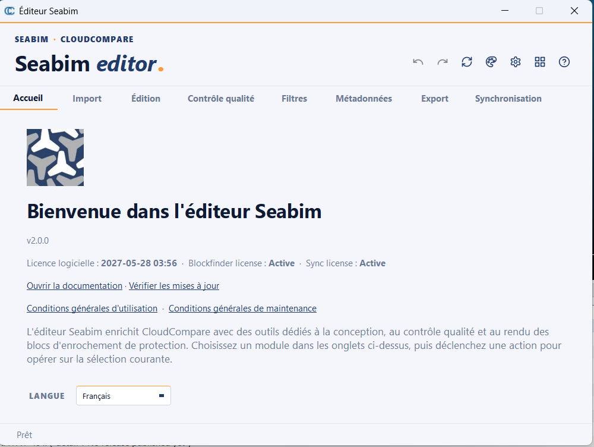

# Activation de la licence

Cette page décrit la procédure d'activation d'une licence SEABIM Editor à
l'aide de **CodeMeter Runtime** de WIBU-SYSTEMS. Elle s'effectue **une
seule fois par poste**, après l'[installation du plugin](installation.md)
et avant de pouvoir créer un [premier projet](premier-projet.md).

## Prérequis

- [SEABIM Editor installé](installation.md) et fonctionnel dans CloudCompare.
- CodeMeter Runtime installé sur le poste (voir le tableau Prérequis de la
  page [Installation](installation.md#prerequis)).
- Un fichier de licence initial **`.lif`** transmis par l'équipe SEABIM.

## 1. Vérifier l'absence de licence active

Une fois SEABIM Editor correctement installé, une icône dédiée apparaît
dans la barre latérale droite de CloudCompare. Tant qu'aucune licence n'a
été activée dans CodeMeter Runtime, un clic sur cette icône affiche le
message d'absence de licence :

## 2. Importer le fichier `.lif`

1. Enregistrez le fichier `.lif` reçu dans un dossier de votre choix.
2. Ouvrez **CodeMeter Control Center**.
3. Glissez-déposez le fichier `.lif` dans la fenêtre de l'application.

La licence apparaît alors dans la liste : un **CmContainer** vient d'être
créé sur votre poste.

## 3. Demander l'activation de la licence

L'étape suivante consiste à générer une **demande de licence** (fichier
`.RaC`) qui permettra à l'équipe SEABIM d'émettre votre licence
définitive.

1. Dans CodeMeter Control Center, cliquez sur **« Mise à jour de la
   licence »** en bas à droite.
2. Suivez les écrans de l'assistant :

3. Transmettez le fichier **`.RaC`** ainsi obtenu à l'équipe SEABIM.

En retour, vous recevrez un fichier **`.RaU`** à importer dans CodeMeter
Control Center selon la même procédure (glisser-déposer ou via l'assistant
de mise à jour).

## 4. Vérifier la licence dans CodeMeter WebAdmin

Vous pouvez à tout moment consulter les informations détaillées de votre
licence depuis **CodeMeter WebAdmin** :

## 5. Valider l'activation dans CloudCompare

Pour finaliser, ouvrez CloudCompare et cliquez sur l'icône **SEABIM** dans
la barre latérale. Une fenêtre récapitulative s'ouvre avec les
informations de votre licence : l'activation est réussie.

À ce stade, vous pouvez enchaîner sur la création de votre [premier
projet](premier-projet.md).

!!! tip "En cas de difficulté"
    Conservez précieusement les fichiers `.lif`, `.RaC` et `.RaU`, et
    contactez le support SEABIM en joignant une capture du message
    d'erreur affiché par CodeMeter Control Center ou par le launcher
    SEABIM Editor.
