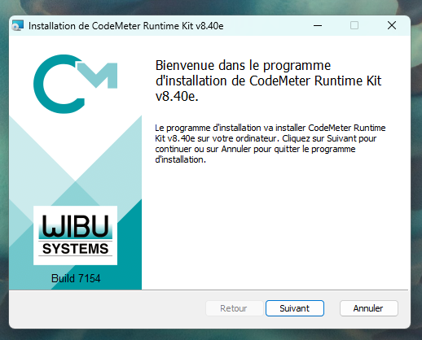
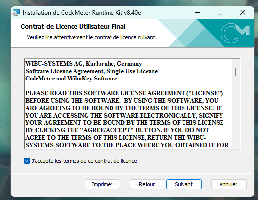
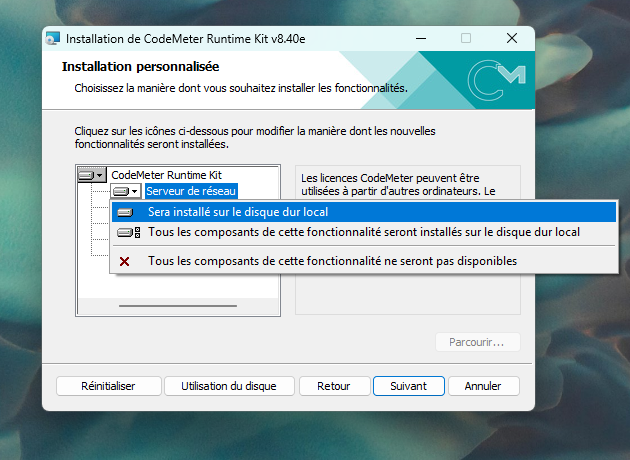
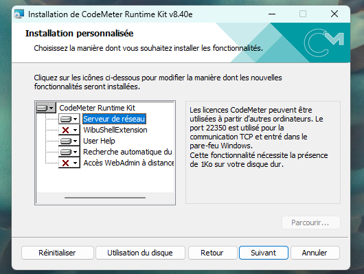
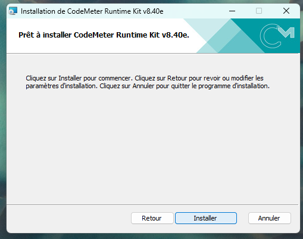

# Installation

SEABIM Editor is a **plugin for CloudCompare 2.13**. It is installed
through a turn-key Windows installer that drops the plugin (DLL + Python
scripts) in CloudCompare's `plugins/` folder and registers the WIBU
license.

## Pre-installation { #pre-installation }

!!! warning "Start from a clean install"
    If **CloudCompare is already installed** on the machine (any version),
    uninstall it first via **Control Panel → Programs and Features →
    CloudCompare → Uninstall**.

    After uninstalling, **manually delete the folder**
    `C:\Program Files\CloudCompare` if it still exists: the uninstaller
    often leaves residual files behind (old plugin DLLs, Python scripts)
    that can prevent SEABIM Editor from loading correctly.

    You can then cleanly install CloudCompare 2.13 (step below).

## Prerequisites { #prerequis }

| Software                    | Version          | Link                                                                       |
| --------------------------- | ---------------- | -------------------------------------------------------------------------- |
| Windows                     | 10 or 11 (x64)   | —                                                                          |
| CloudCompare                | **2.13**         | <https://www.cloudcompare.org/release/CloudCompare_v2.13.2_setup_x64.exe>  |
| CodeMeter Runtime (license) | latest           | <https://www.wibu.com/support/user/user-software/file/download/17494.html> |

!!! warning "CloudCompare 2.13 required"
    The plugin is compiled for CloudCompare 2.13. It will not load in
    version 2.12 or earlier, and has not been tested on 2.14+ builds.

!!! note "Check access to the update server"
    SEABIM Editor needs to reach its update server. From the workstation,
    open <https://update.seabim-utilities.com/health> in a browser: the page
    must display **`ok`**. If it does not respond, check the Internet
    connection, the firewall and the company proxy before continuing.

## Step by step installation

### 1. Install CloudCompare 2.13

Download the Windows installer from the CloudCompare official website and
follow the standard procedure, making sure to enable the Python plugins.

### 2. Install CodeMeter Runtime

The WIBU CodeMeter licensing system is required to activate SEABIM Editor.
Run the **CodeMeter Runtime Kit** installer downloaded from the link in the
prerequisites and follow the wizard:

1. Welcome screen: click **Next**.

   

2. Read the license agreement, tick **I accept the terms of this license
   agreement**, then click **Next**.

   

3. On the **Custom Setup** screen, click the **Network server** feature and
   select **Will be installed on local hard drive** to enable it (it allows
   network licenses over port 23350), then click **Next**.

   
   

4. Click **Install** to start the installation, then **Finish** once it is
   complete.

   

### 3. Run the SEABIM Editor installer

Double-click `SeabimEditor-Setup-X.Y.Z.exe` (provided by your SEABIM
contact) and follow the wizard.

The installer:

- Drops the plugin DLL into `C:\Program Files\CloudCompare\plugins\`
- Drops the Python bundle (`scripts/`, `data-bundled/`) in the same folder
- Creates the user data folder in `%LOCALAPPDATA%\Seabim\`
- Installs the language files (`.qm`) FR / EN / AR

### 4. First activation in CloudCompare

1. Launch **CloudCompare 2.13**.
2. The SEABIM Editor plugin appears in the main toolbar with its icon.
3. Click the icon → the **license check** runs.
4. On success, the **SEABIM Editor launcher** opens with the tabs
   available depending on your Feature Map (for example `Find blocks in
   a point cloud` only appears if the BlockFinder bit is active on your
   license).

If no license is active yet on the workstation, follow the detailed
[License activation](activation-licence.md) procedure.

## Uninstallation

Go through **Control Panel → Programs and Features → SEABIM Editor →
Uninstall**. The operation removes the DLL and the bundle but **keeps
user data** in `%LOCALAPPDATA%\Seabim\` (parameters, profiles, exchanges).

To start fully from scratch, also remove this folder manually after
uninstallation.

## Troubleshooting an installation issue

| Symptom                                                  | Probable cause                                                 | Action                                                                                                       |
| -------------------------------------------------------- | -------------------------------------------------------------- | ------------------------------------------------------------------------------------------------------------ |
| The SEABIM icon does not appear in CloudCompare           | DLL not loaded (wrong CC version, or plugin disabled)          | Check CC version = 2.13. Go to `Plugins → SEABIM Editor` in the CC menu.                                     |
| "Invalid license" message on launch                       | WIBU key missing / not detected                                | Check CodeMeter Runtime is installed and the license is valid. Open CodeMeter Control Center to confirm.     |
| `Import` tab without `Find blocks in a point cloud`       | BlockFinder bit is not in your license Feature Map             | Check with your SEABIM contact for the authorized features.                                                  |
| Silent crash at launch                                    | Python error caught                                            | Check `%LOCALAPPDATA%\Seabim\log\crash.log`.                                                                 |
