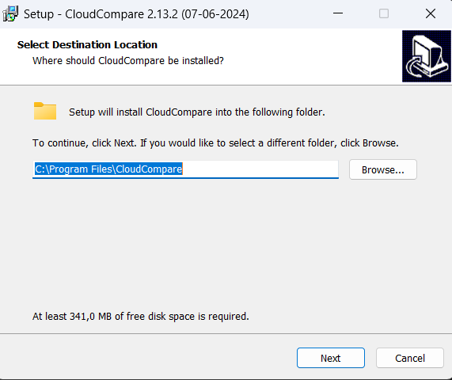
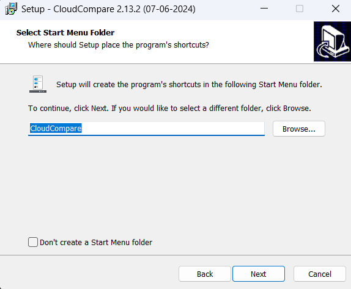
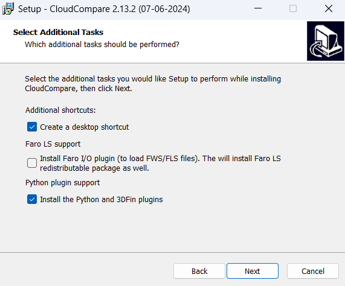
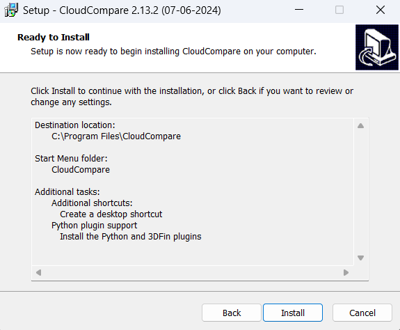
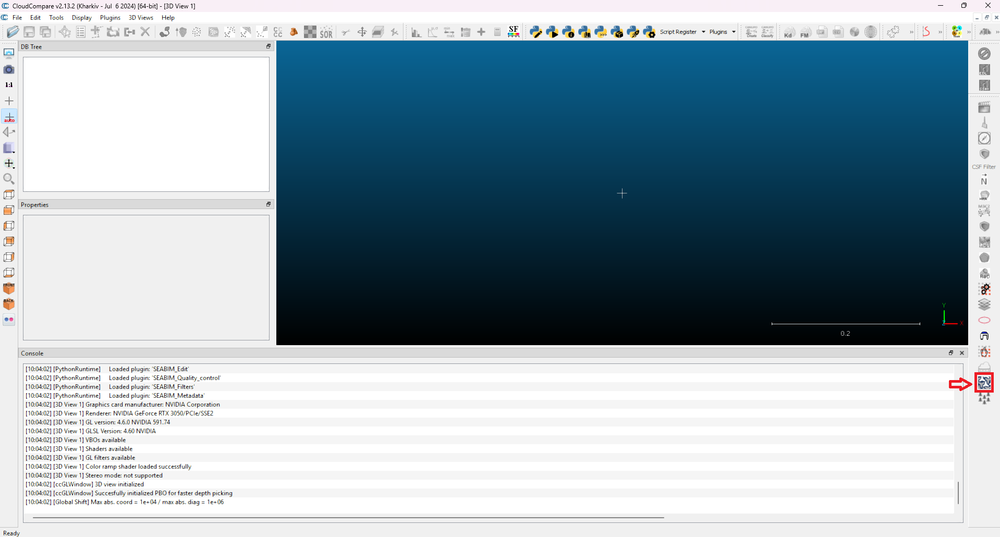

# Installation

SEABIM Editor est un **plugin pour CloudCompare 2.13**. Il s'installe via
un installeur Windows fourni clé en main qui dépose le plugin (DLL + scripts
Python) dans le dossier `plugins/` de CloudCompare et inscrit la licence
WIBU.

## Prérequis { #prerequis }

| Logiciel                    | Version          | Lien                                                                       |
| --------------------------- | ---------------- | -------------------------------------------------------------------------- |
| Windows                     | 10 ou 11 (x64)   | —                                                                          |
| CloudCompare                | **2.13**         | <https://www.cloudcompare.org/release/CloudCompare_v2.13.2_setup_x64.exe>  |
| CodeMeter Runtime (licence) | dernière version | <https://www.wibu.com/support/user/user-software/file/download/17494.html> |

!!! warning "CloudCompare 2.13 obligatoire"
Le plugin est compilé pour la version 2.13 de CloudCompare. Il ne
chargera pas dans une version 2.12 ou antérieure, et n'a pas été testé
sur les builds 2.14+.

## Installation pas à pas

### 1. Installer CloudCompare 2.13

Téléchargez l'installeur Windows depuis le site officiel CloudCompare et
suivez la procédure standard en n'oubliant pas d'activer les plugins Python.

### 2. Installer CodeMeter Runtime

Le système de licence WIBU CodeMeter est requis pour activer SEABIM Editor.
Installer CodeMeter Runtime.

### 3. Exécuter l'installeur SEABIM Editor

Double-cliquer sur `SeabimEditor-Setup-X.Y.Z.exe` (fourni par votre
référent SEABIM) et suivre l'assistant.

L'installeur :

- Dépose la DLL du plugin dans `C:\Program Files\CloudCompare\plugins\`
- Dépose le bundle Python (`scripts/`, `data-bundled/`) dans le même dossier
- Crée le dossier de données utilisateur dans `%LOCALAPPDATA%\Seabim\`
- Installe les fichiers de langue (`.qm`) FR / EN / AR

### 4. Première activation dans CloudCompare

1. Lancer **CloudCompare 2.13**.
2. Le plugin SEABIM Editor apparaît dans la barre d'outils principale,
   avec son icône.
3. Cliquer sur l'icône → la **vérification de licence** s'exécute.
4. En cas de succès, le **launcher SEABIM Editor** s'ouvre avec les
   onglets disponibles selon votre Feature Map (par exemple `Détecter les
   blocs dans un nuage` n'apparaît que si le bit BlockFinder est actif
   sur votre licence).

Si aucune licence n'est encore active sur le poste, suivre la procédure
détaillée [Activation de la licence](activation-licence.md).

## Désinstallation

Passer par **Panneau de configuration → Programmes et fonctionnalités →
SEABIM Editor → Désinstaller**. L'opération supprime la DLL et le bundle
mais **conserve les données utilisateur** dans `%LOCALAPPDATA%\Seabim\`
(paramètres, profils, échanges).

Pour repartir entièrement de zéro, supprimer aussi ce dossier manuellement
après la désinstallation.

## Diagnostiquer un problème d'installation

| Symptôme                                        | Cause probable                                                    | Action                                                                                                               |
| ----------------------------------------------- | ----------------------------------------------------------------- | -------------------------------------------------------------------------------------------------------------------- |
| L'icône SEABIM n'apparaît pas dans CloudCompare | DLL non chargée (mauvaise version CC, ou plugin désactivé)        | Vérifier la version CC = 2.13. Aller dans `Plugins → SEABIM Editor` du menu CC.                                      |
| Message « Licence invalide » à l'ouverture      | Clé WIBU absente / non détectée                                   | Vérifier CodeMeter Runtime installé et licence validée. Ouvrir CodeMeter Control Center pour confirmer la détection. |
| Onglet `Import` sans `Détecter les blocs dans un nuage` | Le bit BlockFinder n'est pas dans la Feature Map de votre licence | Vérifier auprès du référent SEABIM les fonctionnalités autorisées.                                          |
| Crash silencieux à l'ouverture                  | Erreur Python interceptée                                         | Consulter `%LOCALAPPDATA%\Seabim\log\crash.log`.                                                                     |
