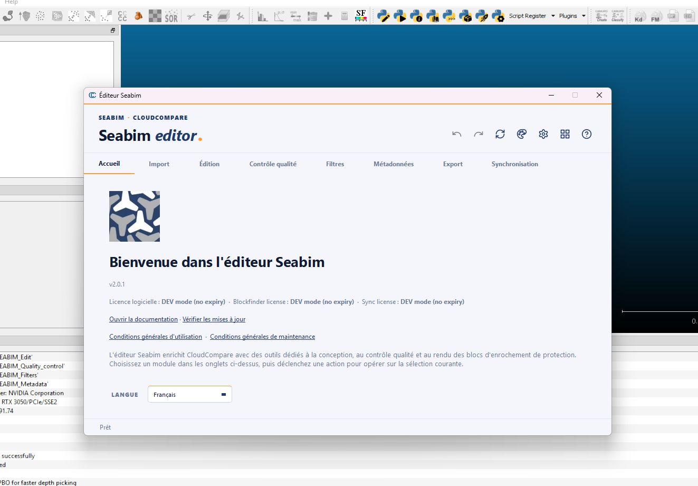

# Interface

The **SEABIM Editor launcher** is a standalone PyQt5 window that opens on
top of CloudCompare. It serves as the entry point for every action of the
plugin and is organised in **tabs** by functional domain.



## Anatomy of the launcher

```text
┌────────────────────────────────────────────────────┐
│  ↶ ↷ ⟳ 🎨 👁 📏 ⚙ ▭ ❓   ← Header (cross-cutting) │
├────────────────────────────────────────────────────┤
│ Home | Import | Edit | Quality control |           │
│ Filters | Metadata | Export   ← Tabs               │
├────────────────────────────────────────────────────┤
│                                                    │
│   [Action button 1]  [Action button 2]  …          │
│   [Action button 3]  [Action button 4]  …          │
│                                                    │
│              ← Active tab action area              │
└────────────────────────────────────────────────────┘
```

- The **header** exposes cross-cutting actions accessible from any tab
  (see [Header module](../modules/header.md)).
- The **tabs**: a `Home` tab (license status), then the business modules
  `Import`, `Edit`, `Quality control`, `Filters`, `Metadata`, `Export` —
  and `Sync` at the end if enabled by license.
- The **action area** displays the buttons of the active module, either
  as a vertical list or as a grid (the case of the
  [Filters](../modules/filters.md) module which exposes 11 actions as a
  grid).

## Available tabs

| Tab               | Purpose                  | Detail                                            |
| ----------------- | ------------------------ | ------------------------------------------------- |
| `Home`            | License status           | Start date and enabled options                    |
| `Import`          | Loading structures       | [Import module](../modules/input.md)              |
| `Edit`            | Block editing            | [Edit module](../modules/edit.md)                 |
| `Quality control` | Quality metrics          | [Quality control module](../modules/quality.md)   |
| `Filters`         | Geometric filters        | [Filters module](../modules/filters.md)           |
| `Metadata`        | Metadata editing         | [Metadata module](../modules/metadata.md)         |
| `Export`          | Saving and exporting     | [Export module](../modules/output.md)             |
| `Sync` ⃰          | Exchange with SEABIM cloud | [Sync module](../modules/sync.md)               |

⃰ The `Sync` tab only appears if the matching license bit is active (see
[License activation](activation-licence.md)).

## Header — cross-cutting actions

The header is always visible:

| Icon  | Action                                                                            | Shortcut                            |
| ----- | --------------------------------------------------------------------------------- | ----------------------------------- |
| ↶     | [Undo](../modules/header.md#undo)                                                 | ++ctrl+z++                          |
| ↷     | [Redo](../modules/header.md#redo)                                                 | ++ctrl+y++ (alias ++ctrl+shift+z++) |
| ⟳     | [Update view](../modules/header.md#update-view)                                   | ++ctrl+r++                          |
| 🎨    | [Change color scale](../modules/header.md#change-color-scale)                     | ++ctrl+l++                          |
| 👁    | [Display by type](../modules/header.md#display-by-type)                           | ++ctrl+d++                          |
| 📏    | [Switch to meters / feet](../modules/header.md#switch-units)                      | ++ctrl+u++                          |
| ⚙     | [Settings](../modules/header.md#settings)                                         | ++ctrl++,                           |
| ▭     | [Reduce window size](../modules/header.md#reduire-la-taille-de-fenetre)           | —                                   |
| ❓    | [Shortcuts help](../modules/header.md#affichage-des-raccourcis)                   | ++f1++                              |

## Button visual states

- **Enabled**: button colored, clickable.
- **Disabled**: button greyed-out. Typical for `Undo` / `Redo` when the
  stack is empty, or for an action that requires a selection (click = no
  effect).
- **Badge**: some actions expose a secondary **badge** to the right of
  the main button (for example [`Registration
  report`](../modules/edit.md#register-selection---adaptive-dist) on the
  `Register selection - Adaptive dist` action). The badge toggles an
  On/Off state bound to the action.

## Tooltips and help

- **Hover** a button to see its description.
- Click the **help icon** of a dialog to open the corresponding
  documentation page in the browser.

## Persistence

- The **internal parameters** (`parameters.json`) and the **user
  profiles** are kept in `%LOCALAPPDATA%\Seabim\`.
- An **autosave** (`autosave.json`) is maintained during the session.

## Multi-language

The launcher is translated into **French**, **English** and **Arabic**.
The language is auto-detected from the system, but can be forced via the
environment variable `SEABIM_LANG=fr|en|ar`.
