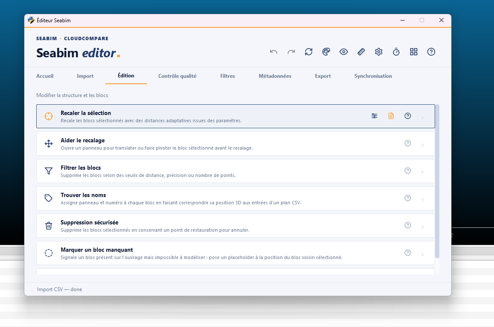
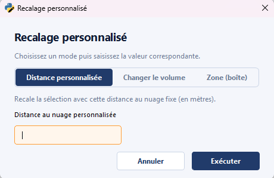
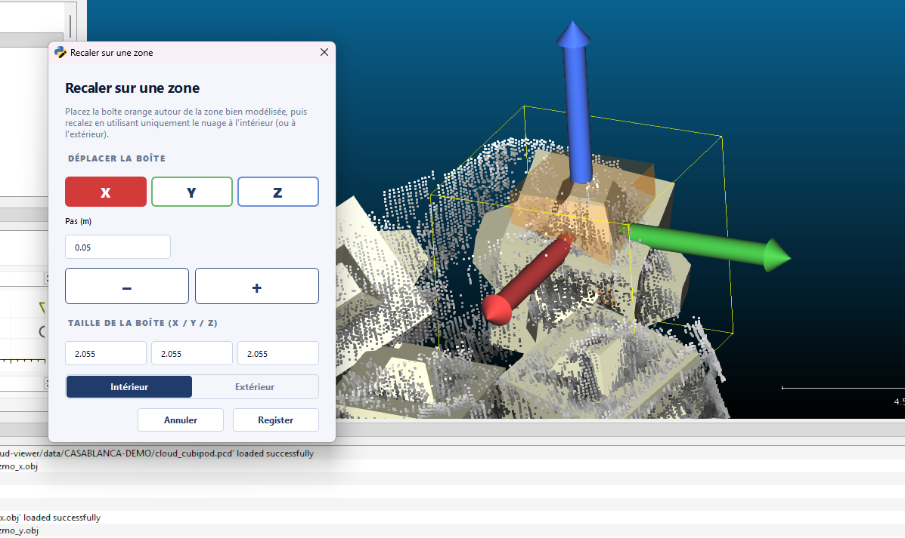
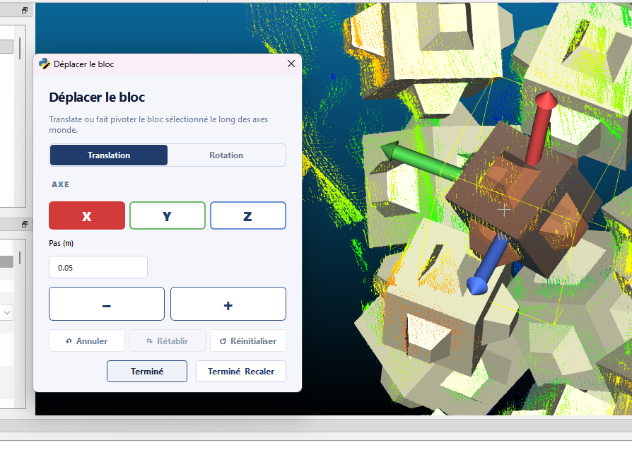
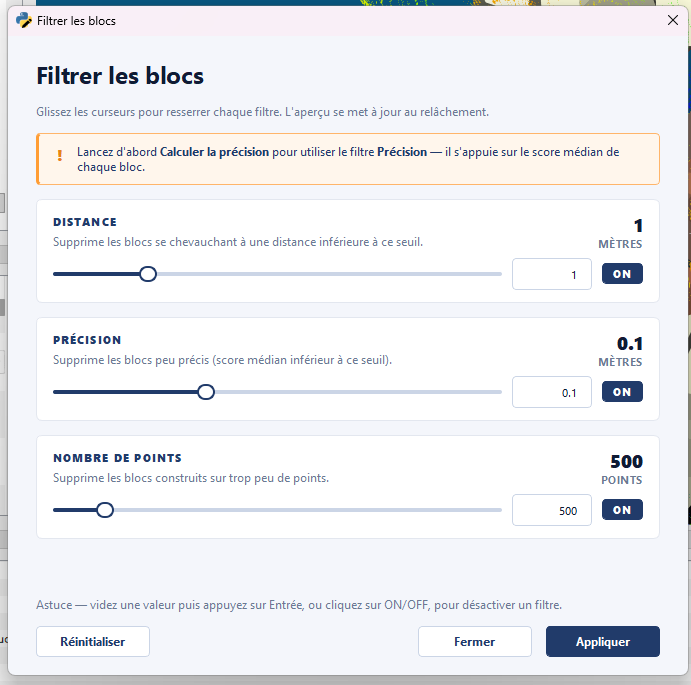
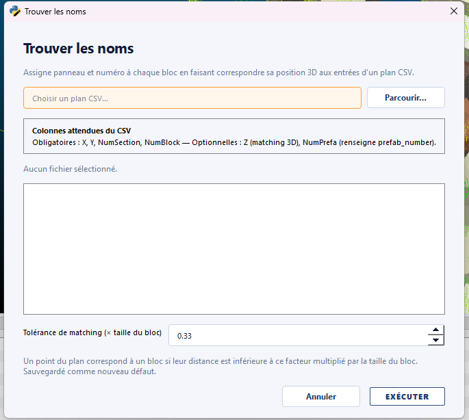
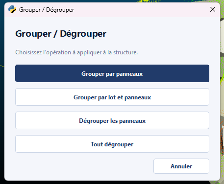

# Edit

The **Edit** module groups the structure editing actions: registration of
blocks on the reference cloud, threshold-based filtering, safe deletion,
grouping by panel or package, and assignment of plot numbers from a
placement plan.

This is the tab where the **correction and refinement** work happens
once a structure has been loaded (from JSON) or detected automatically
(via [`Find blocks in a point
cloud`](input.md#find-blocks-in-a-point-cloud)).

## Register selection { #register-selection---adaptive-dist }

**Shortcut: ++ctrl+e++**

Realigns (registration) the selected blocks on the reference point cloud.
Each block is adjusted independently to minimise its distance to the cloud.
Use after automatic detection or after manually moving a block, to refine its
position.

Everything goes through **a single button**: by default it registers using
**adaptive distance**, and its **small sliders icon** gives access to three
custom modes. A **`Registration report` badge** rounds out the action.

### "Registration report" badge

To the right of the button:

- **Enabled**: a report detailing the moves (translations, rotations, scores)
  opens automatically at the end of each registration.
- **Disabled**: no pop-up; clicking the badge re-enables it and shows the last
  report produced in this session.

### Registration modes

The **small sliders icon** next to the button does not register on its own: it
**configures the mode** that `Register selection` (++ctrl+e++) will then apply.

| Mode                  | Effect                                                                                                                                       |
| --------------------- | ------------------------------------------------------------------------------------------------------------------------------------------- |
| **Adaptive distance** | Default mode. **Adaptive** cloud distances, defined in the project parameters.                                                              |
| **Custom distance**   | Registers with a **fixed cloud distance** instead of the adaptive distances. **Persistent** override for the session.                       |
| **New block volume**  | **Assigns a new volume** to the selection (a different size than the detected one), then registers. Useful when two neighboring volumes were confused (e.g. 2 m³ vs 3 m³). |
| **Zone registration** | Registers using only a **small portion of the cloud** delimited by a box (see below).                                                       |

For the **Custom distance** and **Volume** modes, the entered value is
remembered for the session: the icon stays **orange** and each `Register
selection` reapplies the mode without re-entering it. Selecting "clear" in the
dialog goes back to the adaptive mode.

### Zone registration { #register-selection---zone }

**Zone registration** restricts the adjustment to a **portion of the cloud**
rather than to all the points around the block. This is useful when only part
of the cloud is reliable (noisy zone, parasitic neighboring blocks, interface
between two surveys).

When you pick this mode, a **dedicated panel** opens and spawns a **box** in
the CloudCompare scene:

1. Position and size the box around the portion of cloud to keep (or to
   exclude).
2. Choose to keep the cloud **inside** or **outside** the box.
3. Confirm: registration only considers the retained points. The crop
   distance stays **adaptive**.

Unlike the Distance / Volume modes, zone registration **is not a persistent
override**: the box is spatial and placed by hand on each use.

## Help register { #help-register }

Opens an interactive panel that lets you **translate or rotate** the
selected block before running the registration. Useful when a block's
starting position is too far from the cloud for the automatic
registration to converge.

Typical workflow:

1. Select the block to pre-position.
2. Click `Help register`.
3. Use the arrows / sliders to move the block close to its theoretical
   position on the cloud.
4. On validation, the [`Register selection - Adaptive
   dist`](#register-selection---adaptive-dist) action is run
   automatically.

## Filter blocks { #filter-blocks }

Removes blocks that do not meet quality thresholds: **median distance**
to the cloud, **accuracy**, or **point count** of correspondence.

Dialog parameters:

| Parameter            | Description                                                                                                                                                |
| -------------------- | ---------------------------------------------------------------------------------------------------------------------------------------------------------- |
| `Score threshold`    | Upper threshold on the median of point distances around the block, in meters. Blocks whose score exceeds the threshold are removed.                        |
| `Distance threshold` | Threshold on the distance between block centers, in meters. If two blocks are closer than this threshold, the one with the lowest median distance is kept. |
| `Accuracy threshold` | Threshold on accuracy (quality scalar field). Blocks below are removed.                                                                                    |

!!! tip "First filtering after detection"
    This action is typically used right after automatic detection to
    eliminate false positives before manual registration.

## Find names { #find-names }

Assigns the **plot and block numbers** of the blocks by matching each
block's 3D position to a **placement plan** in CSV format.

Dialog parameters:

| Parameter                               | Description                                                                                                                  |
| --------------------------------------- | ---------------------------------------------------------------------------------------------------------------------------- |
| `Reference plan`                        | Path of the placement plan CSV used to name the blocks.                                                                      |
| `Plan format`                           | Format of the plan (expected columns).                                                                                       |
| `Max distance`                          | Maximum distance, in meters, between a block's center and the matching point on the plan. Past that, the block is "off plan". |
| `Change only blocks without name`       | Only update plot/block numbers for blocks that are **not yet numbered**.                                                     |
| `Offset for renamed block number`       | If set, the assigned block numbers form a sequence starting at this value.                                                   |
| `Plot name for blocks outside the plan` | Plot name given to blocks whose distance to the plan is greater than `Max distance`.                                         |

## Safe delete { #safe-delete }

Removes the selected blocks while keeping an **undo checkpoint**. Unlike
direct deletion via CloudCompare, this action lets you roll back via the
[`Undo`](header.md#undo) button of the [Header](header.md).

## Mark missing block { #mark-missing-block }

Flags a block that **exists physically on the structure but cannot be
modelled** from the point cloud (missing or insufficient data). Because
CloudCompare does not expose 3D picking in the viewport, the position is
taken from a **neighbouring block**:

1. Select the existing block closest to the gap.
2. Click `Mark missing block`.
3. A red **placeholder** (block type `Missing`) is created at that
   block's position.
4. Reposition it over the actual gap with CloudCompare's native
   transformation tool — the new position is read back automatically.

Placeholders are excluded from quality computations (accuracy,
differential, overlap, density), from registration, and from the
placement exports: they only record the gap. They are synchronised to the
cloud viewer through their `Missing` type, so completeness statistics can
account for them, and they show up under **Missing** in
[`Display by type`](header.md#display-by-type). To remove a misplaced placeholder, use
[`Safe delete`](#safe-delete).

## Group / Ungroup { #group--ungroup }

Reorganises the display of the structure in CloudCompare's tree by
**grouping** blocks by panel or package, or **ungrouping** existing
groups.

A single dialog exposes the 4 operations:

| Operation         | Effect                                                                  |
| ----------------- | ----------------------------------------------------------------------- |
| `Group panels`    | Groups blocks sharing the same `plot_number` into a `panel` subgroup.   |
| `Ungroup panels`  | Splits panel groups and moves the blocks back to the top level.         |
| `Group packages`  | Groups blocks sharing the same `package`.                               |
| `Ungroup all`     | Splits every grouping (panel + package).                                |

