# Filtres

Le module **Filtres** calcule des **filtres géométriques de contrôle de
pose** sur la structure courante. Chaque action produit un **champ
scalaire** sur les blocs, qu'on peut visualiser via l'action [`Changer
l'échelle de couleurs`](header.md#change-color-scale) du
[Header](header.md).

L'onglet est affiché en **grille** (11 boutons) plutôt qu'en liste, pour
faciliter la sélection rapide d'un filtre.

!!! tip "Visualiser un filtre"
Après calcul d'un filtre, ouvrir l'action [`Changer l'échelle de
    couleurs`](header.md#change-color-scale) (++ctrl+l++) et sélectionner
le nom du filtre dans la liste des champs scalaires pour appliquer une
coloration sur les blocs.

## Hors profil { #out-profile }

Calcule la **distance de hors profil** : distance d'un bloc au plan moyen
formé par les blocs adjacents. Permet de repérer les blocs trop en
saillie ou trop en retrait par rapport à leurs voisins.

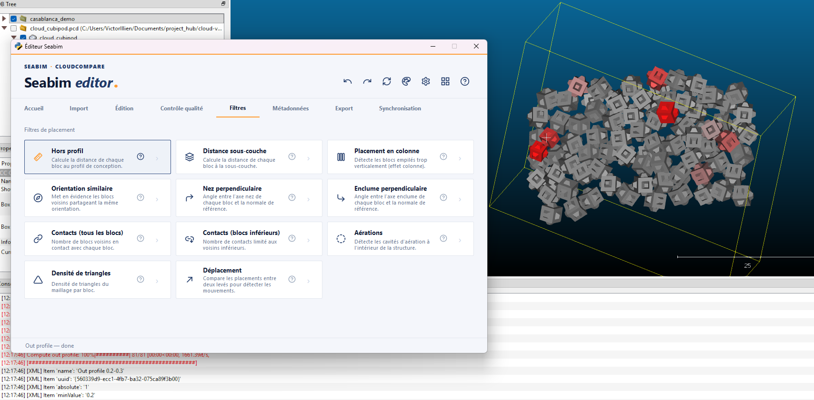

## Distance sous-couche { #underlayer-distance }

Calcule la **distance** entre chaque bloc et la **surface sous-jacente**
(sous-couche). Utile pour vérifier que les blocs reposent correctement sur
la couche inférieure de la digue.

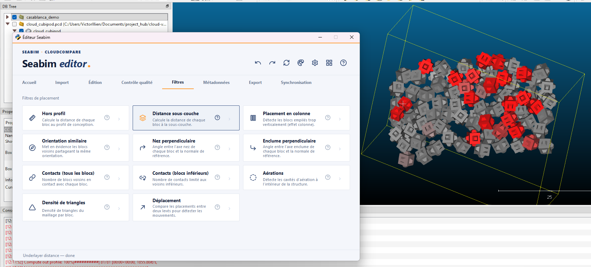

## Placement en colonne { #column-placement }

Met en avant les **couples de blocs voisins empilés verticalement** l'un
au-dessus de l'autre. Une pose en colonne est un défaut : les efforts ne se
répartissent pas correctement entre les couches.

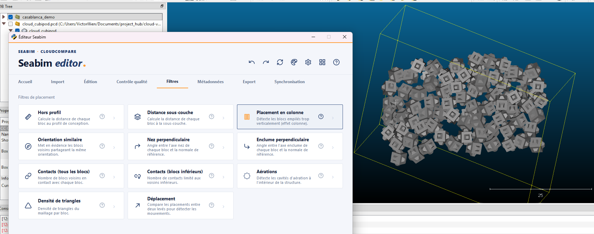

## Orientation similaire { #similar-orientation }

Met en avant les **couples de blocs voisins partageant la même
orientation**. Une orientation trop homogène entre voisins immédiats peut
être un défaut de pose (l'alternance d'orientations participe à la
stabilité).

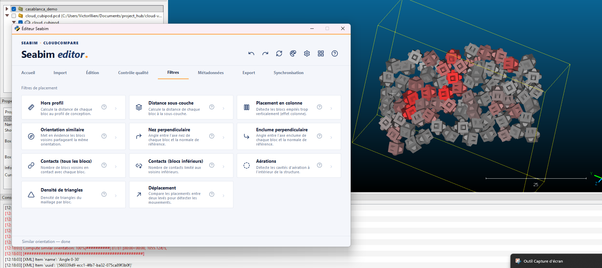

## Nez perpendiculaire { #perpendicular-nose }

Calcule l'**angle entre l'axe « nez » de chaque bloc et la normale au
talus de référence**. Permet de vérifier que les nez de blocs sont
orientés perpendiculairement au talus (orientation théorique optimale).

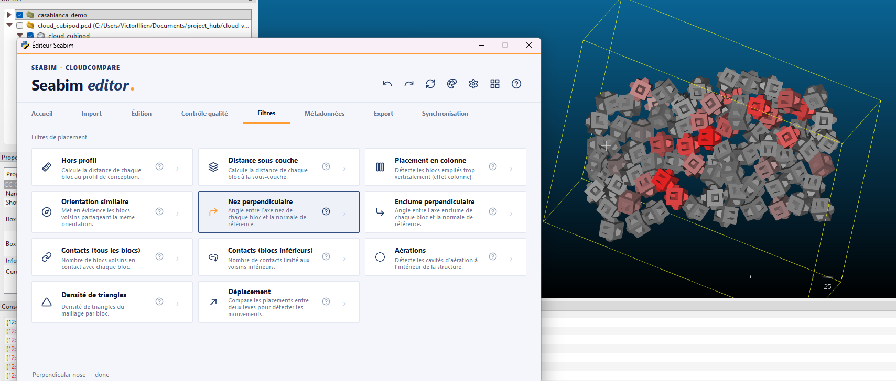

## Enclume perpendiculaire { #perpendicular-anvil }

Identique à [`Nez perpendiculaire`](#perpendicular-nose) mais sur l'**axe
« enclume »** du bloc.

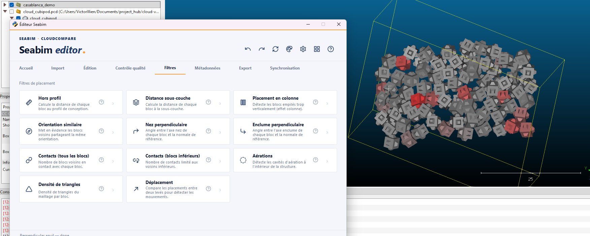

## Contacts (tous les blocs) { #contacts-all-blocks }

Calcule le **nombre de blocs en contact** avec chaque bloc. Un bloc en
contact avec trop peu de voisins est mal stabilisé ; un nombre élevé peut
indiquer une zone trop dense.

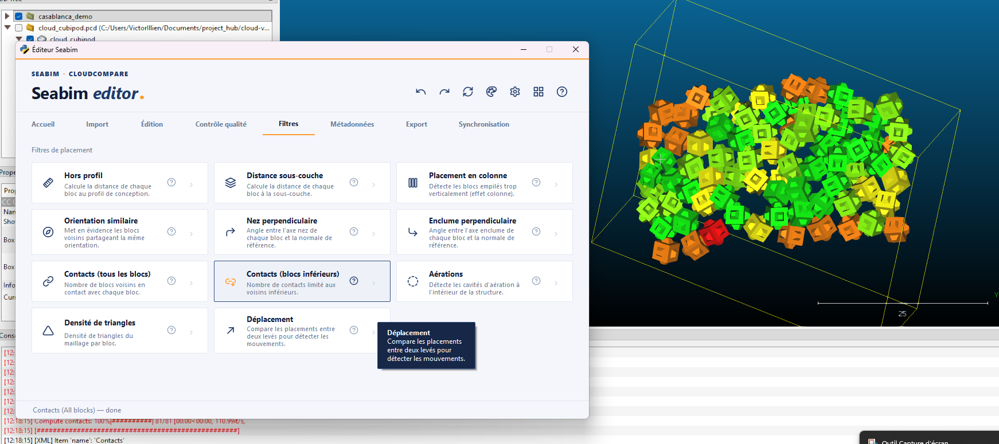

## Contacts (blocs inférieurs) { #contacts-inferior-blocks }

Variante de [`Contacts (tous les blocs)`](#contacts-all-blocks) qui
restreint le décompte aux **blocs situés en couche inférieure**. Permet
d'isoler les appuis structurels sans bruit lié aux blocs latéraux ou
supérieurs.

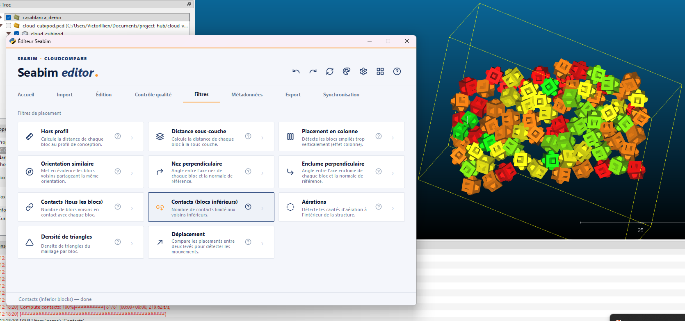

## Aérations { #voids }

Détecte les **cavités d'aération** à l'intérieur de la structure : zones
où l'absence de blocs crée un vide non prévu par le design.

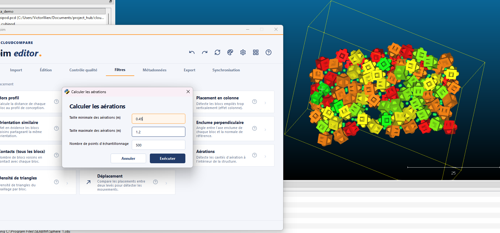

## Densité de triangles { #triangle-density }

Calcule la **densité de triangles du maillage** par bloc. Métrique de
contrôle : un bloc dont la densité de triangles s'écarte fortement de la
moyenne signale souvent un problème géométrique (bloc déformé, mauvais
type).

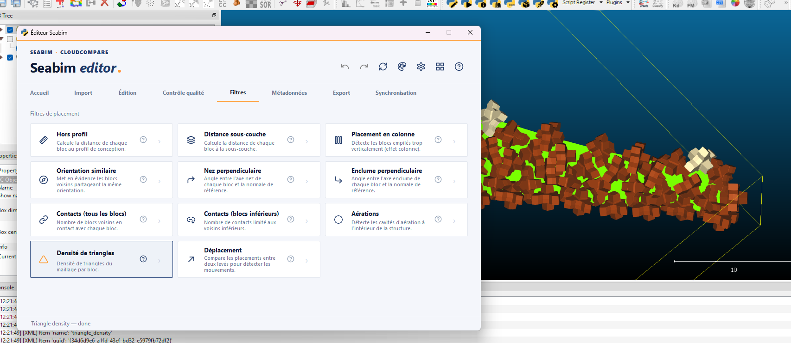

## Déplacement { #displacement }

Calcule le **déplacement** des blocs par rapport à une **structure de
référence** (typiquement le levé précédent), pour repérer les mouvements
entre deux campagnes. La modale **Calculer le déplacement** propose les
réglages suivants :

- **Taille minimale des flèches** et **Valeur maximale du déplacement**
  (relatives à la taille des blocs) : pilotent uniquement la **coloration
  initiale** et la couleur des flèches affichées dans la vue.
- **Échelle de référence** : choisit l'unité dans laquelle le déplacement
  est rapporté pour la coloration.
    - **Absolu** : valeur brute, dans l'unité de travail.
    - **H (taille de bloc)** : déplacement rapporté à la **hauteur
      caractéristique** du bloc (ratio sans dimension).
    - **DN (diamètre nominal)** : déplacement rapporté au **diamètre
      nominal** du bloc (racine cubique de son volume).
- **Méthode d'appariement** : comment associer chaque bloc courant à son
  homologue de la structure de référence.
    - **distance** : par proximité spatiale.
    - **section et numéro** : par identité (même section + même numéro de
      bloc).

!!! note "Le déplacement est stocké en valeur absolue"
    L'échelle choisie ici ne fixe que la coloration et les flèches
    initiales. Le déplacement est conservé en **valeur absolue** sur les
    blocs : **H** et **DN** ne sont que des **vues** recalculées à la
    volée. On peut donc rebasculer vers n'importe quel champ ou échelle via
    [`Changer l'échelle de couleurs`](header.md#change-color-scale) — ou
    [exporter](output.md) dans un autre référentiel — **sans relancer le
    calcul**.

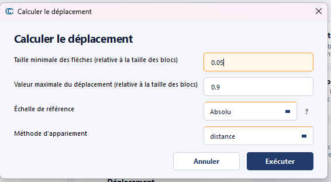
