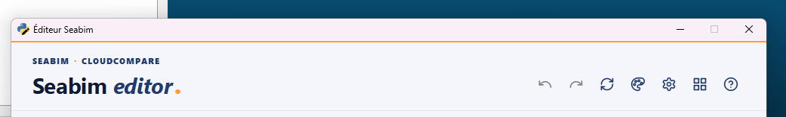
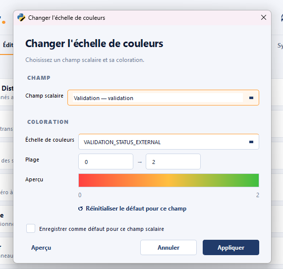
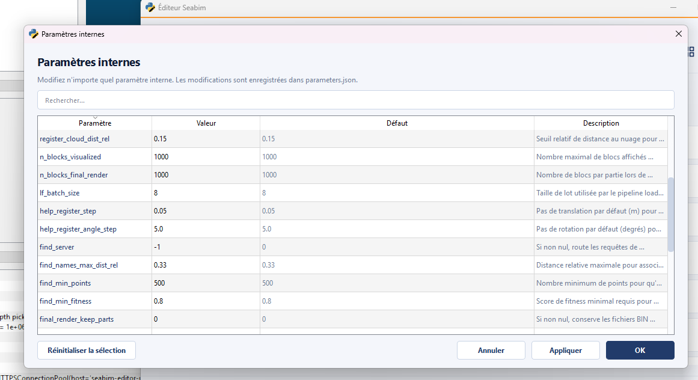
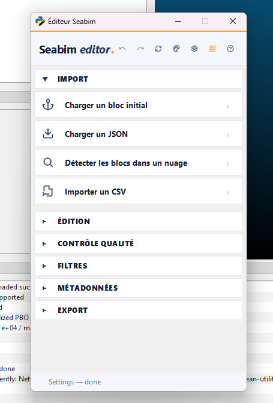
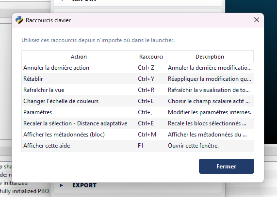

# Header (barre supérieure)

Le **header** est la barre d'icônes en haut du launcher SEABIM Editor.
Ses 7 actions sont **transversales** : elles sont accessibles depuis
n'importe quel onglet et chacune dispose d'un raccourci clavier.

## Annuler la dernière action { #undo }

**Raccourci : ++ctrl+z++**

Annule la **dernière modification de structure**. Les actions d'édition
qui empilent un checkpoint (suppression, recalage, modification par lot,
détection, etc.) peuvent toutes être annulées.

Le bouton est **automatiquement désactivé** tant qu'aucun checkpoint n'est
empilé (par exemple en début de session, ou après une annulation qui a
vidé la pile).

## Rétablir { #redo }

**Raccourci : ++ctrl+y++ (alias : ++ctrl+shift+z++)**

Rétablit la dernière modification qui vient d'être annulée par [`Annuler
la dernière action`](#undo). Désactivé tant que la pile de rétablissement
est vide.

!!! note "Compatibilité raccourcis"
    Le raccourci principal est ++ctrl+y++ (convention Windows). L'alias
    ++ctrl+shift+z++ est fourni pour les utilisateurs habitués à la
    convention Mac / Linux.

## Rafraîchir la vue { #update-view }

**Raccourci : ++ctrl+r++**

Met à jour l'affichage 3D de **tous les blocs** dans CloudCompare. Utile
lorsque la scène n'est plus en cohérence avec l'état interne de la
structure (par exemple après une modification externe d'un JSON, ou un
changement de paramètres d'affichage qui ne s'est pas propagé).

## Changer l'échelle de couleurs { #change-color-scale }

**Raccourci : ++ctrl+l++**

Ouvre la modale qui permet de choisir :

- Le **champ scalaire actif** (par exemple `accuracy`, `overlap`,
  `out_profile`, `displacement`, …)
- La **palette de couleurs** appliquée à ce champ
- Éventuellement, les **bornes** min/max de la coloration

C'est le complément naturel des modules [Filtres](filters.md) et
[Contrôle qualité](quality.md) : calculer un filtre produit un champ
scalaire, `Changer l'échelle de couleurs` permet de le visualiser.

## Paramètres { #settings }

**Raccourci : ++ctrl++,**

Ouvre la modale **Paramètres** qui édite les paramètres internes du
plugin : valeurs par défaut des actions, options d'affichage, flags de
debug (par exemple `enable_profiling`), seuils par défaut des filtres, etc.

Les modifications sont persistées dans `parameters.json` dans le dossier
de données utilisateur (`%LOCALAPPDATA%\Seabim\` en mode installeur,
`C:\Program Files\SEABIM\` en mode développement).

!!! tip "Profilage des performances"
    Activer `enable_profiling = 1` dans Paramètres produit, à chaque clic
    d'action, un fichier `.prof` (cProfile) + `.txt` (top-30 cumulé) dans
    `<DATA_FOLDER>/profiles/`. À couper après usage, le coût est de
    l'ordre de 5–10 % sur les actions instrumentées.

## Réduire la taille de fenêtre { #reduire-la-taille-de-fenetre }

Bascule le launcher entre deux dispositions :

- **Vue normale** : tous les modules visibles en onglets horizontaux
  (`Import`, `Édition`, `Contrôle qualité`, `Filtres`, `Métadonnées`,
  `Export`).
- **Vue compacte** : sidebar verticale en accordéon, sections repliables.
  Pratique quand on veut donner plus de place à CloudCompare ou travailler
  sur un écran étroit.

Le bouton fonctionne comme un toggle : un clic active le mode compact, un
deuxième clic ramène à la vue normale.

!!! note "Bascule automatique"
    Le launcher passe automatiquement en mode compact dès que la largeur
    de sa fenêtre descend sous **600 pixels**, et revient en mode normal
    quand on l'élargit à nouveau. Inutile donc de cliquer le bouton si on
    veut juste redimensionner la fenêtre — le mode adapté se choisit tout
    seul.

!!! tip "Persistance"
    Le mode compact n'est **pas mémorisé entre deux ouvertures du
    launcher** : chaque session redémarre en vue normale.

## Affichage des raccourcis { #affichage-des-raccourcis }

**Raccourci : ++f1++**

Ouvre une fenêtre qui liste **tous les raccourcis clavier** disponibles
dans la session courante, regroupés par origine :

- Les 7 actions du header (Annuler, Rétablir, Rafraîchir la vue, Changer
  l'échelle de couleurs, Paramètres, Réduire la fenêtre, Affichage des
  raccourcis).
- Les actions des modules ayant un raccourci déclaré (par exemple
  [`Recaler la sélection - Distance
  adaptative`](edit.md#register-selection---adaptive-dist) avec
  ++ctrl+e++ ou [`Afficher les métadonnées
  (bloc)`](metadata.md#show-metadata-block) avec ++ctrl+m++).

!!! tip "Aide contextuelle rapide"
    ++f1++ est un raccourci global de l'application : il fonctionne depuis
    n'importe quel onglet, même si le focus est sur une modale enfant.
