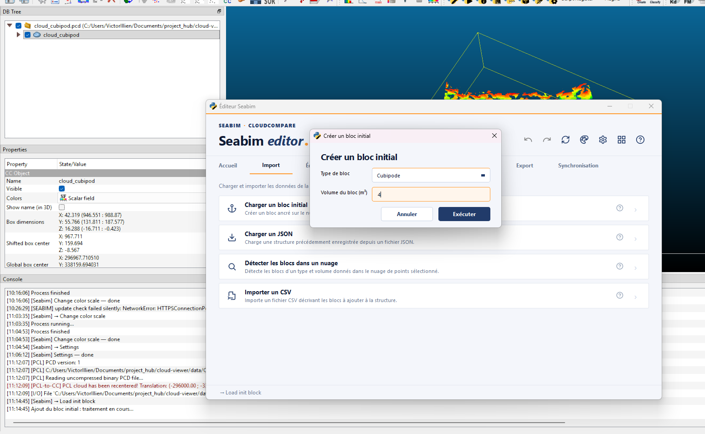
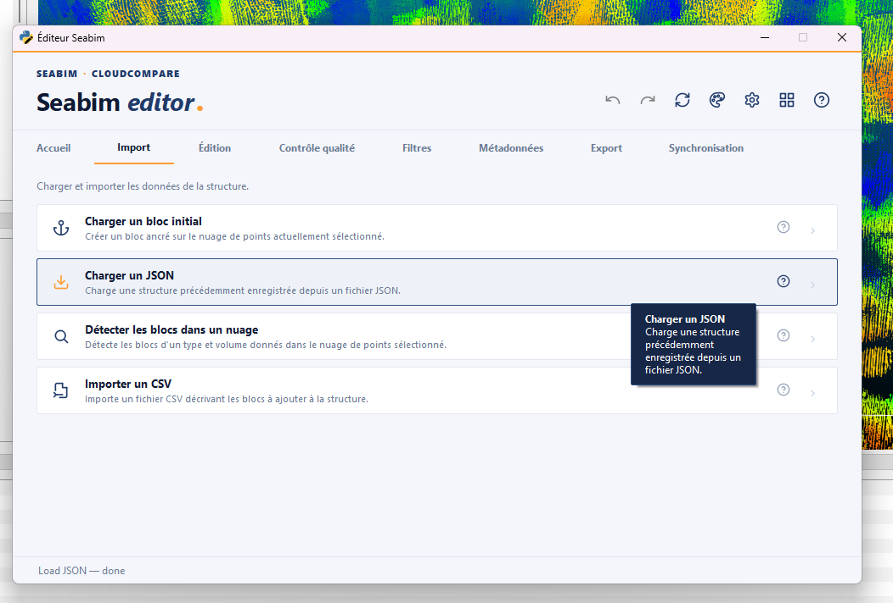
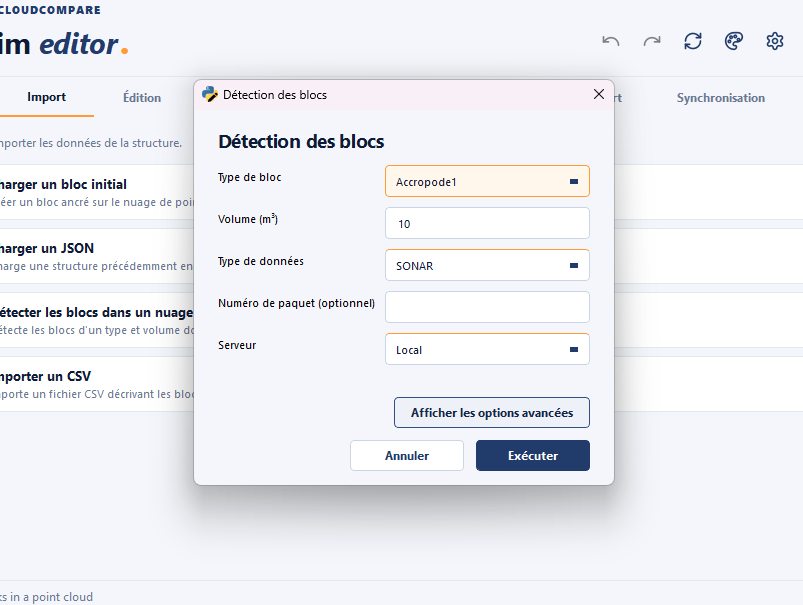
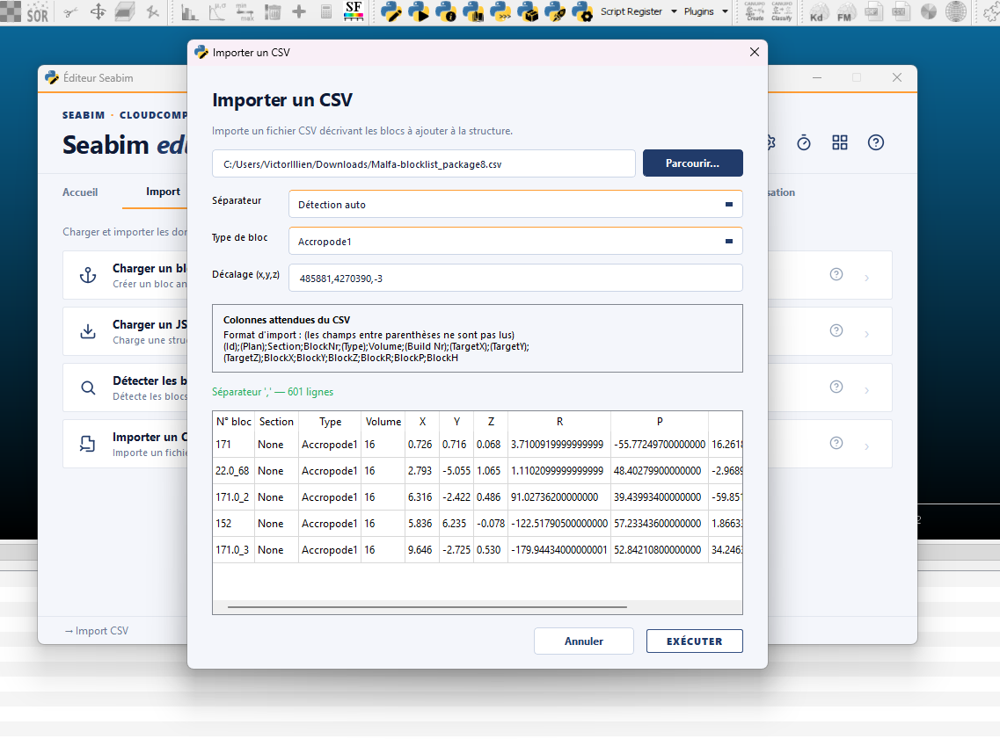

# Import

The **Import** module groups the **loading** actions for structures:
creation of an initial block from a cloud, opening of a JSON file,
automatic block detection and import from an external CSV.

This is typically the first tab used at the start of a session.

!!! info "Action availability"
    Some actions are conditioned by the WIBU license: `Find blocks in a
    point cloud` only shows up if the BlockFinder bit is active in the
    client's Feature Map.

## Load init block { #load-init-block }

Creates an **anchor block** locked on the currently selected point cloud
in CloudCompare. This block acts as a reference for subsequent operations
(positioning, manual registration, etc.).

Use this action when working **without automatic detection**: place a
single block on the cloud, then duplicate and register each neighboring
block one by one via [`Help register`](edit.md#help-register) and
[`Register selection - Adaptive
dist`](edit.md#register-selection---adaptive-dist).

This is also the action used to **start a project without a BlockFinder
license**: the structure is built manually from a single reference block.

## Load JSON { #load-json }

Opens a previously saved structure JSON file (see [`Save
JSON`](output.md#save-json)).

This is the action used to **resume a project**: pull the last delivered
JSON (suffix `_find`, `_filtered`, `_manual_n` depending on the
milestone — see [Structure file
naming](../workflow/formats-fichiers.md#json-naming)) and
continue the work where it was left off.

!!! tip "Autosave"
    If the previous session ended badly (CloudCompare crash, brutal
    shutdown), the launcher keeps an `autosave.json` in the user data
    folder. Loading this file restores the state right before the
    incident.

## Find blocks in a point cloud { #find-blocks-in-a-point-cloud }

Automatically detects blocks of a **given type and volume** in the
selected point cloud. The produced structure can then be cleaned via
[`Filter blocks`](edit.md#filter-blocks) and refined with [`Register
selection - Adaptive dist`](edit.md#register-selection---adaptive-dist).

This is the entry point of the **automatic reconstruction** workflow
described in [Standard procedure § Automatic
reconstruction](../workflow/procedure-courante.md#auto-reconstruction).
Several detections may run in parallel in distinct CloudCompare windows
to process different zones simultaneously.

!!! tip "Detection best practices"
    - Run detection on a cloud **cut into zones of 500 m max** (see [cloud
      cutting](../workflow/procedure-courante.md#cutting))
      to limit computation time and ease batch processing.
    - Always apply [`Filter blocks`](edit.md#filter-blocks) right after
      detection to remove false positives before manual registration.

!!! warning "License-gated action"
    This action is only available if the workstation's license includes
    the **BlockFinder** feature. Without that right, the button does not
    appear in the Import tab.

## Import CSV { #import-csv }

Imports a CSV file describing the blocks to add to the structure.

Useful to **inject a list of positions coming from an external tool**
(theoretical placement plan, export from another software, file produced
by a business script) without going through automatic detection. The
blocks are created at the CSV positions; their fine registration on the
cloud still needs to be done via the [Edit](edit.md) module.

The import dialog makes reading heterogeneous files easier:

- **Separator choice**: `Auto` (automatic detection), `,`, `;` or tab. The
  `Auto` mode analyzes the first lines to guess the right separator.
- **Interpreted preview**: the first lines of the file are shown as they
  will be read, to check the column splitting before confirming.
- **Automatic offset**: for large coordinates (UTM for example), an offset
  is proposed to bring positions back into a workable range.

!!! note "CSV format"
    The CSV expects one row per block and **16 columns** in the order
    `Id;Plan;Section;BlockNr;Type;Volume;…;BlockR;BlockP;BlockH`. The exact
    format is documented in [File formats § CSV
    files](../workflow/formats-fichiers.md#csv-files).
