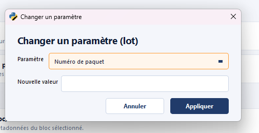
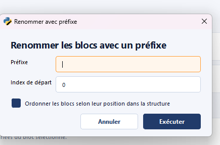
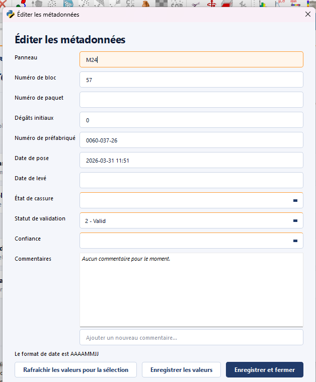
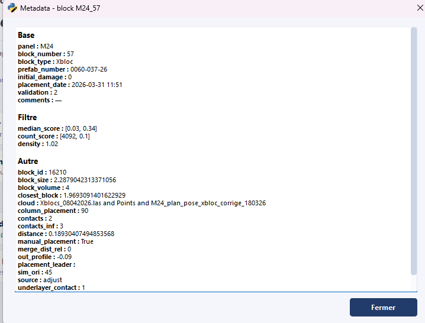

# Metadata

The **Metadata** module groups the tools for **editing block metadata**:
changing a parameter value, renumbering, and consulting / fine-editing
a single block.

The 4 actions are split into two categories:

- **Batch**: acts on every block currently selected in the CloudCompare
  scene.
- **Block**: acts on the single selected block.

## Change parameter (Batch) { #change-parameter-batch }

**Category: Batch**

Updates a **single parameter** on every selected block at once. Useful to
homogenize a field (for example `block_type`, `package`, or any other
metadata attribute) over an entire zone.

!!! warning "Destructive action"
    The operation overwrites the previous value on every affected block.
    Save (action [`Save JSON`](output.md#save-json)) before a large batch,
    and use [`Undo`](header.md#undo) if you need to roll back.

## Rename blocks with prefix (Batch) { #rename-blocks-with-prefix-batch }

**Category: Batch**

Applies a **prefix** to the selection and **reindexes** the blocks behind
that prefix. This is the **batch renaming** operation typically used at
the end of processing to produce a clean final naming before the delivery
render.

Example: `B-0001`, `B-0002`, … for every selected block, where `B-` is
the prefix and `0001`, `0002`… is the sequential index.

!!! note "Prerequisite for the final render"
    This action is mentioned in the [standard
    procedure](../workflow/procedure-courante.md#final-render) as the
    **reindexing** step preceding [`Export final
    render`](output.md#export-final-render). It guarantees that the final
    numbering is continuous and gap-free.

## Metadata editor (Block) { #metadata-editor-block }

**Category: Block**

Opens an editor that lets you **modify any metadata field** of the
selected block. Where [`Change parameter
(Batch)`](#change-parameter-batch) targets one field at a time across N
blocks, this action targets N fields at a time on a single block.

## Show metadata (Block) { #show-metadata-block }

**Category: Block · Shortcut: ++ctrl+m++**

Displays in read-only mode the metadata of the selected block, **grouped
by category** (`Base`, `Filter`, `Other`). Quick consultation action
with no risk of modification.

