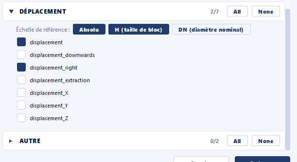

# Export

The **Export** module groups the **output** actions: saving the current
structure as JSON, CSV export (standard or custom columns), and
generation of the final render ready for delivery.

## Save JSON { #save-json }

Saves the current structure to a JSON file. The format is the one
described in section [Structure JSON
file](../workflow/formats-fichiers.md#json-structure).

!!! tip "Frequent saving recommended"
    The SEABIM Editor module keeps an `autosave.json` in the data folder,
    but a manual save named after the
    [nomenclature](../workflow/formats-fichiers.md#json-naming)
    is essential at the work milestones (`find`, `filtered`, `manual_n`).

## Export CSV { #export-csv }

Exports the structure's blocks to CSV. The action covers two cases in a
unified dialog:

- **Standard**: the usual columns (position, type, volume, plot, block)
  for exchange with another tool.
- **Custom**: free selection of columns to export based on the metadata
  present in the structure.

In the custom selection, the **Displacement** section is topped by a
**Reference scale** row (multi-select: `Absolute`, `H`, `DN` — see
[Displacement](filters.md#displacement)). Each combination of *checked field ×
active scale* produces **its own column** (`displacement`, `displacement_dn`,
`displacement_h`, `displacement_downwards_dn`…). If no scale is active, the
displacement fields are greyed out.

## Export final render { #export-final-render }

Generates the **final delivery render** as **CloudCompare BIN** files, split
into parts. A dialog lets you choose precisely **which blocks** to export,
**how** to split them and **which fields** to keep.

### Splitting options

| Option                         | Effect                                                                                                                                                        |
| ------------------------------ | ----------------------------------------------------------------------------------------------------------------------------------------------------------- |
| `Blocks per part`              | Number of blocks per BIN file. Pre-filled from the parameters (`n_blocks_final_render`), editable here.                                                       |
| `Split exported parts by panel`| When checked, each part contains **one panel** and is named after it (e.g. `M24`) instead of `Part 1`, `Part 2`… Only affects how the BIN is split and named, not the coloring (which uses the `panel` field). |
| `Sort blocks alphabetically`   | Orders the blocks within each part.                                                                                                                          |
| `Keep intermediate raw parts`  | Keeps the per-part `*_raw.bin` files written **before the CloudCompare merge** (useful for debugging). When unchecked, they are deleted after the merge.       |

!!! note "Oversized panels"
    In "Split exported parts by panel" mode, if a panel exceeds the
    blocks-per-part limit, a window offers to **split** it (`M24`, `M24_2`…) or
    **keep it whole** (a single part for that panel).

### Selection filters

When the structure contains **several types** or **several volumes** of blocks,
**`Block types`** and **`Volumes`** sections appear: only blocks whose **type
AND volume** are checked are exported. If there is only one type (or volume),
the matching section is hidden and all blocks are kept on that side.

### Fields to export

Scalar fields are grouped into collapsible sections: **Block main properties**
(`panel`), **Quality control**, **Placement filters**, **Displacement** and
**Other**. Check the ones to keep in the delivered render. A field **not
computed** on the blocks appears greyed out and marked "(not computed)": there
is nothing to export for it.

!!! note "Displacement: reference scales and delivered coloring"
    As in the CSV export, the **Displacement** section offers a **Reference
    scale** row (multi-select: `Absolute`, `H`, `DN`). Each *field × scale*
    combination generates **its own scalar field** ("Displacement",
    "Displacement / DN", "Displacement / H"…), **recomputed from the absolute
    value** at export time — without re-running the displacement computation.
    The color scale of displacement fields is moreover **frozen in absolute**,
    so the delivered coloring **stays correct after the BIN is reloaded** by the
    recipient.

    

!!! note "Final step of the workflow"
    This action is the final step described in the [standard
    procedure](../workflow/procedure-courante.md#final-render). It is
    preceded by a **reindexing** (action [`Rename blocks with prefix
    (Batch)`](metadata.md#rename-blocks-with-prefix-batch) of the
    [Metadata](metadata.md) module) which ensures continuous numbering
    without gaps before delivery.
