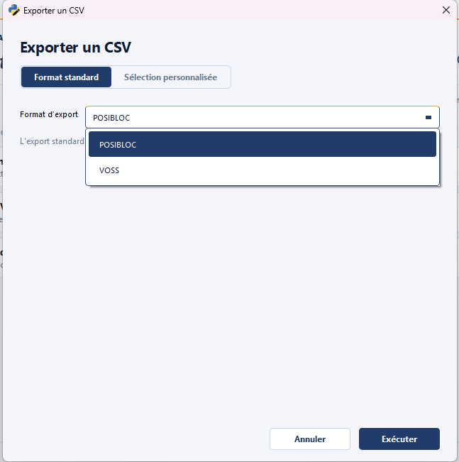
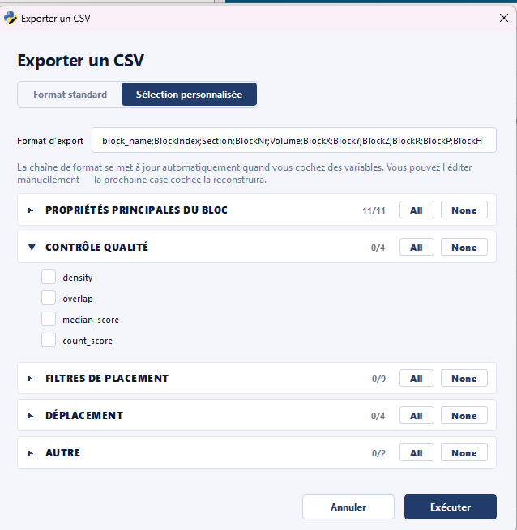
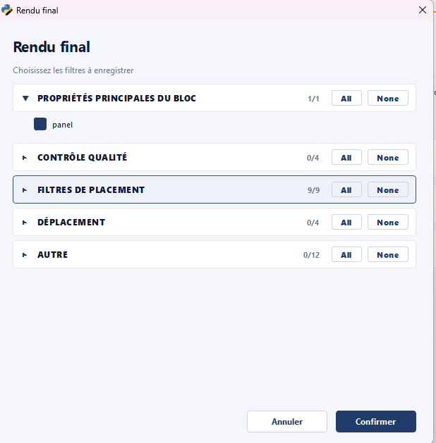

# Export

Le module **Export** regroupe les actions de **sortie** : sauvegarde de la
structure courante en JSON, export CSV (standard ou colonnes
personnalisées), et génération du rendu final prêt pour livraison.

## Sauvegarder un JSON { #save-json }

Sauvegarde la structure courante dans un fichier JSON. Le format est celui
décrit dans la section [Fichier de structure JSON](../workflow/formats-fichiers.md#json-structure).

!!! tip "Sauvegarde fréquente recommandée"
Le module SEABIM Editor maintient un fichier `autosave.json` dans le
dossier de données, mais une sauvegarde manuelle nommée selon la
[nomenclature](../workflow/formats-fichiers.md#json-naming)
est essentielle aux jalons de travail (`find`, `filtered`, `manual_n`).

## Exporter un CSV { #export-csv }

Exporte les blocs de la structure en CSV. L'action couvre deux cas dans une
modale unifiée :

- **Standard** : les colonnes habituelles (position, type, volume, plot,
  bloc) pour échange avec un autre outil.
- **Personnalisé** : sélection libre des colonnes à exporter selon les
  métadonnées présentes dans la structure.

## Exporter le rendu final { #export-final-render }

Génère un **rendu final** sous forme de fichiers BIN CloudCompare prêts
pour la livraison, en intégrant les filtres de contrôle qualité.

!!! note "Étape finale du workflow"
Cette action est l'étape finale décrite dans la [procédure
courante](../workflow/procedure-courante.md#final-render). Elle est
précédée d'une **réindexation** (action [`Renommer les blocs avec un
    préfixe (lot)`](metadata.md#rename-blocks-with-prefix-batch) du module
[Métadonnées](metadata.md)) qui assure une numérotation continue avant
la livraison.
