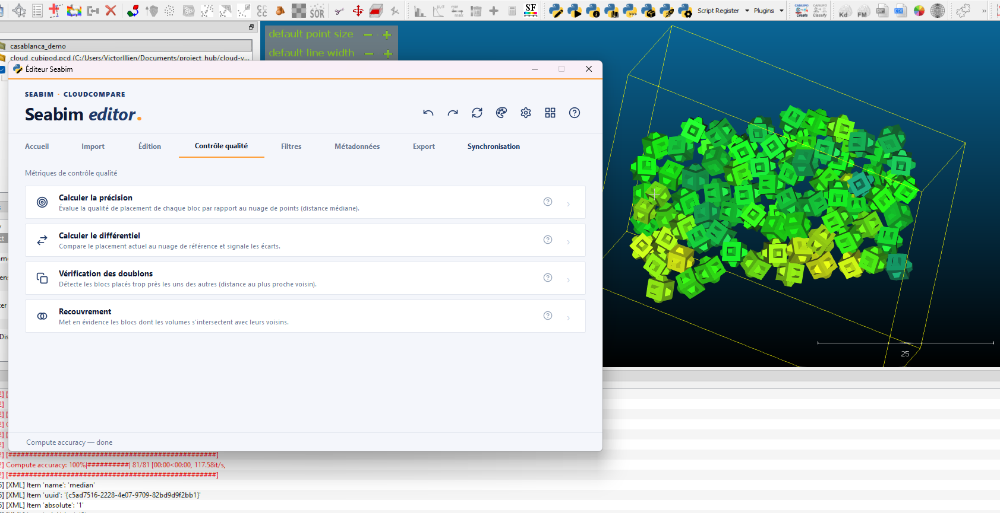
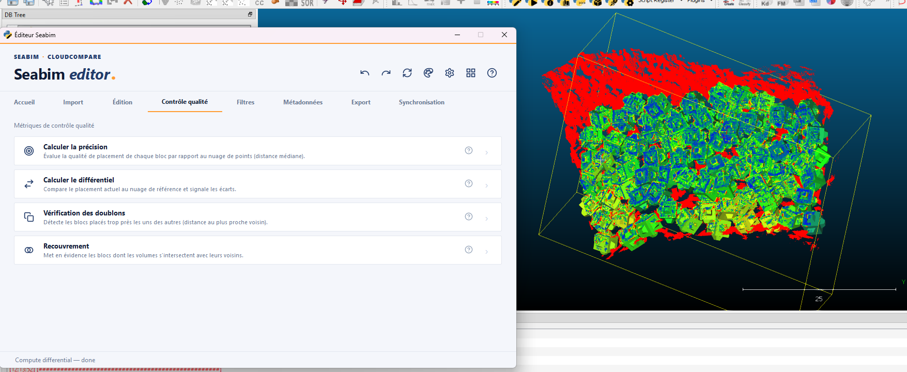
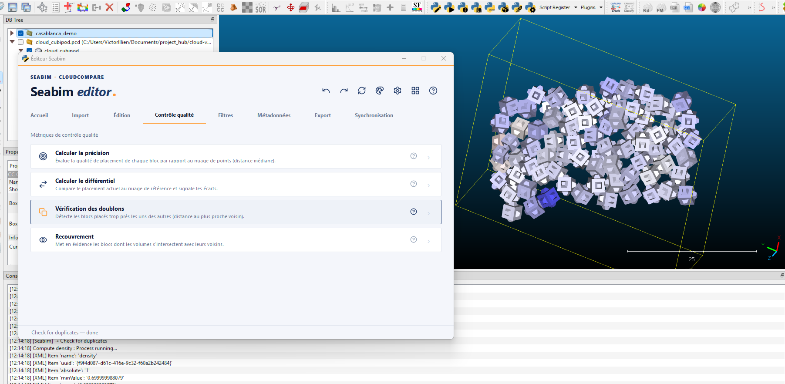
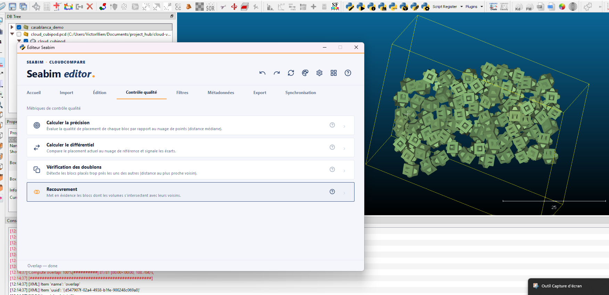

# Contrôle qualité

Le module **Contrôle qualité** regroupe les métriques de qualité de la
pose : précision de l'ajustement au nuage, écarts au design, doublons,
chevauchements de volumes.

Là où [Filtres](filters.md) calcule des filtres **géométriques** (relations
entre blocs voisins), Contrôle qualité se concentre sur des métriques de
**fidélité au nuage de référence** et de **cohérence interne** de la
structure.

## Calculer la précision { #compute-accuracy }

Calcule, pour chaque bloc, la **distance médiane** entre les points du
nuage de référence situés autour du bloc et la surface du bloc. C'est le
score de **précision** principal de SEABIM Editor : plus il est faible,
mieux le bloc colle au nuage.

À visualiser via l'action [`Changer l'échelle de
couleurs`](header.md#change-color-scale) en sélectionnant le champ
scalaire `accuracy`.

!!! tip "Usage typique"
Lancer `Calculer la précision` après un **recalage** (action [`Recaler
    la sélection - Distance
    adaptative`](edit.md#register-selection---adaptive-dist) du module
[Édition](edit.md)) pour vérifier que les blocs sont bien ajustés. Les
blocs en rouge (précision élevée) méritent un nouveau recalage ou une
inspection manuelle.

## Calculer le différentiel { #compute-differential }

Calcule la **distance entre les points du nuage de référence et la
structure** modèle (différentiel point-cloud vs blocs). Produit un nuage
de points coloré par déviation, qui met en évidence les **écarts
résiduels** : poches du nuage non couvertes par des blocs, zones où les
blocs débordent du nuage, etc.

Permet de repérer rapidement les zones qui demandent une **reconstruction
manuelle complémentaire**.

## Vérification des doublons { #check-for-duplicates }

Détecte les blocs **trop proches les uns des autres** en calculant la
distance au plus proche voisin (nearest-neighbor distance). Sous un
certain seuil, deux blocs représentent vraisemblablement la **même
réalité physique** (doublon de détection).

À utiliser typiquement après une détection automatique pour nettoyer la
structure avant le recalage.

## Recouvrement { #overlap }

Met en évidence les blocs dont le **volume intersecte celui d'un voisin** :
deux blocs ne peuvent pas occuper le même espace physique, un recouvrement
signale donc une erreur de positionnement.

Le résultat est un champ scalaire `overlap` exprimant la **fraction du
volume du bloc en intersection avec ses voisins**.

!!! note "Différence avec Contacts"
[`Contacts`](filters.md#contacts-all-blocks) compte les blocs qui se
**touchent**. `Recouvrement` détecte les blocs qui se
**superposent** (ce qui est physiquement impossible et donc forcément
un défaut de pose).
